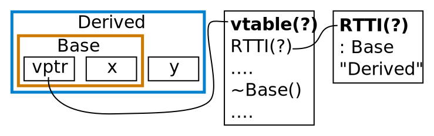

## План
1. Тонкости из домашек:
  1. If with init statement.
  1. Передача параметров в функции и умные указатели.
  1. Как объявлять константы.
1. `auto [a, b] = my_set.insert(....)`
  * Нам потребуется `std::tuple<int, int, int>`
  * Удобный сахар, но с подвохами, надо знать.
1. RTTI (Run-Time Type Information)
  * Через него работает `dynamic_cast`.
  * Потребуется на практике.
1. Unqualified lookup для функций, ADL.
  * Почему `std::operator<<`, но пишем `using std::cout; cout << a`?

---
## 1.1. If with init statement (C++17)
<!-- На лекции, чтобы попало на экзамен. -->

До:
```c++
map<int, string> m = ....;
{
    typename map<int, string>::iterator it = m.find(10);
    if (it != m.end()) cout << it->second << '\n';
    else               cout << "Not found\n";
}  // После этой скобки `it` недоступен
```

После (строго лучше): <!-- обвести два куска, проверсти аналогию с `for` -->
```c++
map<int, string> m = ....;
if (auto it = m.find(10); it != s.end()) {
    cout << it->second << '\n';
} else {
    cout << "Not found\n";  // it тут доступен.
}  // После этой скобки `it` недоступен.
```

Аналогично полезно с `.insert()`, `dynamic_cast<T*>`, смотри [`25-200416p/problems/01-basic/06-dynamic-cast.cpp`](https://github.com/yeputons/hse-2019-cpp/blob/26daebb971d2c5b6f8f995e7aa40fdf9ebfce486/25-200416p/problems/01-basic/06-dynamic-cast.cpp)

---
## 1.2.1. Передача параметров в функции
Смотри [GotW 91](https://herbsutter.com/2013/06/05/gotw-91-solution-smart-pointer-parameters/) (Guru of the Week, автор — Herb Sutter).

* Практически всегда по значению, `&&` и умные указатели не нужны:
    ```c++
    void foo(vector<int> foo_data) { sort(foo_data.begin(), foo_data.end(); .. };
    int main() {
        vector<int> data = {1, 2, 3, 4, 5};
        foo(data);  // Тут скопируем, вектор ещё нужен.
        data.emplace_back(6);  // {1, 2, 3, 4, 5, 6}
        foo(std::move(data));  // Разрешили не копировать.
        data.clear();  // Вектор мог остаться непустым, не определено moved-from.
    }
    ```

* Если хотим отдать что-то с именем (даже `&&`) — пишем `std::move`:
    ```c++
    template<typename T> struct MyVector {
        vector<T> data;
        MyVector(vector<T> data_) : data(std::move(data_)) { /* data_ = ?? */ }
        void push_back(T &&value) { data.emplace_back(std::move(value)); }
    };
    ```

---
## 1.2.2. Параметры только для чтения/для записи
* Если нам вcегда передают объект, а мы его только читаем:
  ```c++
  void printVector(const vector<int> &data);
  ```

* Если иногда не передают — `std::optional` (не указатель!):
  ```c++
  void maybePrintVector(const std::optional<vector<int>> &data);
  ```

* Если нам всегда нужно передать наружу объект (не указатель!):
  ```c++
  void readAndAppendToVector(vector<int> &data);
  ```
  _Осторожно_: а что, если `data` исходно непуст? Верните по значению или задокументируйте.

* Если пользователь не всегда хочет ответ — указатель.
  <!-- Указатель здесь лучше ссылки только потому что в нём может быть `nullptr`. В указатель запишем ответ. Владеет им вызывающий. -->
  ```c++
  void readAndMaybeAppendToVector(vector<int> *const data);
  ```

---
## 1.2.3. Rvalue-ссылки в параметрах
Не нужно, если объект умеет только `move` ([`unique_ptr`](https://stackoverflow.com/a/8114913/767632)):
```c++
void foo(unique_ptr<Foo> x /* unique_ptr<Foo> &&x */);
unique_ptr<Foo> bar;
foo(bar);             // Не скомпилируется в обоих случаях.
foo(get_bar());       // Скомпилируется в обоих случаях.
foo(std::move(bar));  // Скомпилируется в обоих случаях.
```
<!--
Это может быть чуть менее эффективно в общем случае: тут
мы вызываем лишний конструктор перемещения и деструктор.
Для `unique_ptr` всё равно.
-->

Обычно не нужно, если объект можно копировать:
```c+++
void foo(Foo &&x);
Foo bar;
foo(bar);             // Не компилируется.
foo(Foo(bar));        // Надо явно копировать, но так не принято.
foo(std::move(bar));  // Явно мувать можно всегда.
```

Иногда `&&` нужно для оптимизаций или move-конструкторов:

```c++
void push_back(const T&);
void push_back(T&&);
```

---
## 1.2.4. Умные указатели в параметрах
Умный указатель — пара `(данные, владение)`.
В параметрах — только если нам важно, как именно им владеет __вызвавший__.
Обычно неважно.

* `const unique_ptr<T>&` — лучше заменить на `T&` (`const` явно исчез). <!-- константен только сам указатель; а вдруг у нас вообще объект на стеке? Тоже уникальный владелец -->
  * Это не семантика &laquo;у объекта один владелец&raquo; — стэк, поле...
* `unique_ptr<T>&` — почти никогда <!-- пример: swap, за деталями — в GotW -->
* `const shared_ptr<T>&` — почти никогда <!-- пример: когда иногда хотим себе скопировать, за деталями — в GotW  -->
* `shared_ptr<T>&` — почти никогда

```c++
// Функция хочет скопировать владение `window` куда-то ещё.
void addToAnotherDesktop(shared_ptr<Window> window) {  // shared_ptr по значению.
    recentlyMovedWindows.emplace_back(window);
    myWindows.emplace_back(std::move(window));
}
```
```c++
Node(Node left_, Node right_)
    : left(make_unique<Node>(std::move(left_))), .... {}
// Оптимизация: всегда оборачиваем в `unique_ptr`, давайте сразу его возьмём.
Node(unique_ptr<Node> left_, unique_ptr<Node> right_)  // Без &&
    : left(std::move(left_)), right(std::move(right_)) {}
```

---
## 1.3.1. Как объявлять константы вне классов
<!-- Если внутри `.cpp`/`.h`, не внутри классов: -->

Лучше с `constexpr` вместо `const`: https://github.com/isocpp/CppCoreGuidelines/blob/master/CppCoreGuidelines.md#Rconst-constexpr
```c++
constexr int N = 10000;
int arr[N];
```
Это не форсирует вычисление в compile-time, но требует возможность.

Не прокатит со сложными объектами и поделом: проблемы с порядком инициализации
между разными translation unit.

```c++
// my.h
const std::string FileOption = "--file";  // const => internal linkage!
// a.cpp
#include "my.h"
.... &FileOption ....  // (1), отличается от (2), и ладно?
// b.cpp
#include "my.h"
.... &FileOption ....  // (2), отличается от (1), и ладно?
```
Можно `extern` и думать про ODR, но лучше `constexpr char FileOption[]`.

---
## 1.3.2. Статические константы-члены класса
```c++
// foo.h
struct Foo {
    static const int N = 10;  // external linkage!
    static constexpr char Name[] = "NAME";  // external linkage до C++17
};
// foo.cpp


.. Foo::N ..          // ok
.. Foo::Name[0] ..    // ok
.. &Foo::N ..         // undefined reference?
.. &Foo::Name[0] ..   // undefined reference?
}
// main.cpp
.. Foo::N ..          // ok
.. Foo::Name[0] ..    // ok
.. &Foo::N ..         // undefined reference?
.. &Foo::Name[0] ..   // undefined reference?
```

Как с функциями или глобальными переменными: мы только _объявили_ константу
(несмотря на наличие инициализатора).

---
## 1.3.3. Определение констант
```c++
// foo.h
struct Foo {
    static const int N = 10;  // external linkage!
    static constexpr char Name[] = "NAME";  // external linkage до C++17
};
// foo.cpp
const int Foo::N;            // Инициализировать уже не надо.
constexpr char Foo::Name[];  // Слово `static` не нужно.
.. Foo::N ..         // ok
.. Foo::Name[0] ..   // ok
.. &Foo::N ..        // ok
.. &Foo::Name[0] ..  // ok
}
// main.cpp
.. Foo::N ..         // ok
.. Foo::Name[0] ..   // ok
.. &Foo::N ..        // ok
.. &Foo::Name[0] ..  // ok
```

Обязаны определить, причём ровно один раз (ODR).
Не всегда, но лучше не рисковать (IFNDR хуже UB).

---
## 1.3.4. Идеальное объявление констант
С C++17 можно добавить слово `inline` к переменным и константам
([TotW&nbsp;168](https://abseil.io/tips/168) — Tip of the Week), как для функций:

* Все объявления становится и определениями.
* Разрешается несколько определений, если они совпадают по токенам
  * Иначе **IFNDR** (ill-formed, no diagnostics required), UB навсегда.

Итого: **почти всегда `constexpr`, а в заголовках — всегда `inline`**.

```c++
struct Foo {
    static inline const std::string BAD = "Use constexpr";
    static inline constexpr char Name[] = "NAME";
};
inline const std::string BAD = "Really, use constexpr";
inline constexpr char Name[] = "NAME";
```

<!--
Из `static constexpr` в C++17 следует `inline`, но я рекомендую всё равно писать.
-->

---
## 2.1.1. `std::tuple`
Аналог `std::pair`, но хранит произвольное количество элементов
(гетерогенный список).

```c++
std::tuple<int, vector<int>, string> t(10, vector<int>(2), "foo");
auto t2 = std::make_tuple(10, vector<int>(2), "foo");  // t == t2
int a = std::get<0>(t);     // 0, 2 — константа времени компиляции.
string c = std::get<2>(t);  // Цикла по tuple<> нет.
```

Есть неявная конверсия из `pair<>` и `tuple_cat` (пригодится в метапрограммировании):
```c++
std::pair<int, string> p(10, "foo");
std::tuple<int, string> t = p;  // Неявная конверсия pair --> tuple.
auto tt = std::tuple_cat(t, t);
```
Можно узнавать тип элемента и размер на этапе компиляции:
```c++
std::tuple_element_t<0, decltype(tt)> x = std::get<0>(tt);
static_assert(std::tuple_size_v<decltype(tt)> == 4);
```

---
## 2.1.2. Интересности с `std::tuple`
<!-- Можно пропустить -->
Пригодится нам потом в метапрограммировании:
```c++
void foo(int a, string b);
// ....
auto t = std::make_tuple(10, "hello");
std::apply(foo, t);  // foo(10, "hello");
```

Можно хранить ссылки (в `pair` тоже):
```c++
int a = 10; string b = "foo";
std::tuple<int&, string&> t(a, b);
t = std::make_tuple(20, "bar");  // a == 20, b == "bar"
assert(a == 20);
assert(b == "bar");
```
С этим есть эффекты, аккуратно разбирать пока не будем.

Можно почти как в Python:
```c++
// std::tuple<int, string> bar() { return {30, "baz"}; }
std::tie(a, b) = bar();  // a == 30, b == "baz"
```

---
## 2.2.1. Structured binding — базовое
С С++17 можно почти совсем как в Python:

```c++
std::pair<int, string> p(10, "foo");
auto [a, b] = p;  // a == 10, b == "foo"
b += "x";  // b == "foox", p.second == "foo"
```

К `auto` можно добавлять `const`/`&`/`static`:

```c++
auto& [a, b] = p;  // a == 10, b == "foo"
b += "x";  // b == p.second == "foox"
```

* Есть direct initialization: `auto [a, b](p);`.
* Есть list initialization: `auto [a, b]{p};`.
* Указать тип отдельных `a`/`b` нельзя.
* Нельзя вкладывать: `auto [[a, b], c] = ...`.
* Нельзя в полях.
* Происходит на этапе компиляции: можно с массивами, но не с векторами.
* Также работает с очень простыми структурами.

---
## 2.2.2. Structured binding — применения
Удобно получать значения `pair` из `.insert`.
```c++
map<int, string> m = ....;
if (auto [it, inserted] = m.emplace(10, "foo"); inserted) {
    cout << "Inserted, value is " << it->second << '\n';
} else {
    cout << "Already exists, value is " << it->second << '\n';
}
```

Удобно итерироваться по `map`.
```c++
for (const auto &[key, value] : m) {
    cout << key << ": " << value << '\n';
}
```

---
## 2.3.1. Как работает
```c++
auto [key, value] = *m.begin();
/*                  ^^^EXPR^^^ */
```
превращается в
```c++
// 1. Объявляем невидимую переменную ровно так же.
//    Для примера тут copy initialization.
auto e = *m.begin();  // map<int, string>::value
                      // pair<const int, string>
using E = pair<const int, string>;
// 2. Проверяем количество аргументов.
static_assert(std::tuple_size_v<E> == 2);
// 3. Объявляем элементы.
std::tuple_element_t<0, E> &key   = get<0>(e);  // Или e.get<0>()
std::tuple_element_t<1, E> &value = get<1>(e);  // Или e.get<1>()
```

* На самом деле `key` и `value` — ссылки в невидимый `e`.
* Время жизни такое же, как у `e`.
* Костантность и ссылочность получаем от `tuple_element_t`.
  * В частности, `const auto &[a, b] = foo()` продлит жизнь временному
    объекту.

---
## 2.3.2. Подробности structured binding
Поддерживаются три формы привязки:

1. Если массив известного размера:
   ```c++
   Foo arr[3];
   auto [a, b, c] = arr;
   // превращается в
   auto e[3] = { arr[0], arr[1], arr[2] };
   Foo &a = e[0], &b = e[1], &c = e[2];
   ```
* Если не массив, то `tuple_size<>`, `get<>`...
  * Можно предоставить для своего типа, но надо думать про `get`
    от `const` (deep или shallow?) и
    [прочие тонкости](https://stackoverflow.com/questions/61340567).
* Иначе пробуем привязаться ко _всем_ нестатическим полям.
  ```c++
  struct Good { int a, b; }
  struct GoodDerived : Good {};

  struct BadPrivate { int a; private: int b; }  // Приватные запрещены.
  struct BadDerived : Good { int c; }  // Все поля должны быть в одном классе.
  ```

---
## 2.3.3. Тонкости structured binding
В зависимости от `auto`/`auto&`/`const auto&` и инициализатора у нас получаются немного разные типы.

* `auto&` попробует привязать ссылку.
* `const auto&` продлит жизнь временному объекту.
* `auto` всегда скопирует объект целиком, а не просто его кусочки.

Если внутри объекта лежали ссылки, то может [сломаться время жизни](https://stackoverflow.com/a/51503253/767632):
```c++
namespace std {
    std::pair<const T&, const T&> minmax(const T&, const T&);
}
auto [min, max] = minmax(10, 20);  // Только копирование значений?
// перешло в
const pair<const int&, const int&> e = {10, 20};
// Сам `e` — не временный, поэтому продления жизни нет.
// e.first и e.second ссылаются на уже умершие 10 и 20.
const int &min = e.first;   // Oops.
const int &max = e.second;  // Oops.
```

Рекомендация: осторожно с функциями, которые возвращают ссылки.
С ними лучше `std::tie`.

---
## 3.1.1. RTTI и `dynamic_cast`
* Run-Time Type Information для полиморфных типов
  * Хотя бы одна виртуальная функция.
* `dynamic_cast` смотрит на самом деле на RTTI.

```c++
struct Base { virtual ~Base(); int x; };
struct Derived : Base { int y; };

Base *b = ...;
Derived *d = dynamic_cast<Derived*>(b);
```

Может выглядеть так (а может и по-другому):


---
## 3.1.2. RTTI и `typeid(..)`
```c++
#include <typeinfo>
// ....
Derived d;
Base *b = &d;
const std::type_info &info_b = typeid(*b);  // Всегда(!) по const&
assert(info_b == typeid(d));
assert(info_b == typeid(Derived));
assert(info_b != typeid(Derived*));
```

При этом ничего про тип узнать нельзя: reflection отсутствует, поля не перечислить,
родителей не перечислить...

Но можно делать безопасный type erasure вместо `void*`:
```c++
void print(const std::any &a) {
    if (auto *pInt = std::any_cast<int>(&a); pInt)  // Как dynamic_cast.
        cout << "int: " << *pInt << '\n';           // Нужен в точности int.
}
// ....
print(10);    // int: 10
print("foo"); //
```

---
## 3.1.3. `type_info::name()`
```c++
template<class T> struct X {};
// ....
char const *name = typeid(X<int>).name();
std::cout << name << '\n';  // 1XIiE ???
```

`type_info::name()` по стандарту возвращает _что угодно_.

* Может совпадать у разных типов
* Может отличаться от запуска к запуску
* Иногда помогает расшифровать при помощи `boost::core::demangle`
    * `sudo apt install libboost-all-dev` — в Boost очень много полезного.

```c++
#include <boost/core/demangle.hpp>
// ....
std::cout << boost::core::demangle(name) << '\n';  // X<int>
```

---
## 3.1.4. `type_index`
* `type_info` нельзя положить в контейнер:
  ```c++
  set<const std::type_info&> known_types;  // Не компилируется.
  ```
  * Нельзя копировать и перемещать, только по `const type_info&`.
  * Нет `std::hash<>` (есть `.hash()`) и нет `operator<` (есть `.before()`).
* По `name()` нельзя, он может совпадать у разных типов.
* По адресам `type_info` нельзя: про них никаких гарантий нет.
* Есть обёртка `std::type_index` (можно и самому написать):
  ```c++
  #include <typeindex>
  // ....
  set<std::type_index> known_types;
  known_types.insert(typeid(int));
  known_types.insert(typeid(short));
  known_types.insert(typeid(std::type_index));
  ```

---
## 3.1.5. Тонкости `typeid`
Всегда отбрасывает ссылки и `const char* const --> const char*`.

* От типа — на этапе компиляции:
  ```c++
  const std::type_info &t1 = typeid(Base);
  const std::type_info &t2 = typeid(Base*);
  assert(typeid(Base) == typeid(const Base&));
  ```
* От неполиморфного выражения — на этапе компиляции:
  ```c++
  struct A { int x; };
  struct B : A { int y; };
  // ....
  B b; const A &bref = b;
  assert(typeid(bref) == typeid(A));
  // ....
  const A& foo() { assert(false); static B b; return b; }
  assert(typeid(foo()) == typeid(A));  // foo() не вызывается.
  ```
* От полиморфного — вычисляет и смотрит тип.
  * Если получил `nullptr`, то кидает `std::bad_typeid`.

---
## 3.1.6. Использование RTTI
Применения:

* `dynamic_cast<>`
* Type erasure: сохраняем любые копируемые объекты в `std::any` (вместо `void*`)
  и используем `any_cast` без UB.

При этом исторически стоит дорого, много не умеет => редко используется => бывают баги в компиляторах и занимает много памяти.

* Во встраиваемом программировании отрубается `-fno-rtti`
* Можно реализовать самому как библиотеку: смотри [Boost.TypeIndex](https://www.boost.org/doc/libs/1_72_0/doc/html/boost_typeindex.html).

---
## 4.1.1. Argument-dependent lookup (ADL)
Ссылки: [GotW 30](http://www.gotw.ca/gotw/030.htm), [StackOverflow](https://stackoverflow.com/a/8111750/767632)

```c++
namespace std {
    ostream& operator<<(ostream &os, string &s);
}
// ....
std::ostream &output = ....;
std::string s;
output << s;  // Почему не std::operator<<(output, s); ?
```
ADL: если видим _неквалифицированный_ вызов функции, то смотрим на типы
аргументов и ищем функции во всех связанных namespace'ах.

Удобно для операторов.

<blockquote style="font-style: italic">
Во-первых, в зависимости от типа аргумента, ADL работает девятью разными способами, убиться веником.
(<a href="https://habr.com/ru/company/jugru/blog/447900/">источник</a>)
</blockquote>

---
## 4.1.2. Примеры работающего ADL
[Обобщение](http://www.gotw.ca/publications/mill02.htm): если мы вместе с классом дали пользователю какую-то функцию,
то она должна иметь те же моральные права, что и методы.

```c++
std::filesystem::path from("a.txt");  // C++17
std::filesystem::path to("a-copy.txt");
copy_file(from, to);  // copy_file не метод, ей не нужен доступ к приватным полям.
copy_file("a.txt", "a-copy-2.txt");  // Не компилируется, ADL не помог.
std::filesystem::copy_file("a.txt", "a-copy-2.txt");  // Надо явно указать.
```

Range-based-for и structured binding ищут `begin()`/`end()`/`get()` через ADL:
```c++
namespace ns {
    struct Foo { int x; };
    const int* begin(const Foo &f) { return &f.x; }
    const int* end(const Foo &f) { return &f.x + 1; }
};
int main() {
    ns::Foo f{20};
    for (int x : f) std::cout << x << '\n';
}
```
Причём _только_ через ADL: объявить `begin`/`end` глобально — ошибка.

---
## 4.1.3 Примеры отключённого ADL
```c++
namespace foo {
    namespace impl {
        struct Foo { int x; };
        int func(const Foo &f) { return f.x; }
        int foo(const Foo &f) { return f.x; }
    }
    using impl::Foo;
}
namespace bar::impl {
    struct Bar{ int x; };
    int func(const Bar &f) { return f.x; }
}

int main() {
    foo::Foo f;
    bar::impl::Bar b;
    func(f);  // ok
    func(b);  // ok
    foo::impl::foo(f);  // Qualified lookup, no ADL, ok.
    foo::foo(f);  // Qualified lookup, no ADL, compilation error.
    foo(f);  // compilation error: namespace foo
}
```

---
## 4.1.4. `std::swap` и ADL
[Откуда взялся текущий `std::swap`](https://stackoverflow.com/a/5695855):

```c++
namespace std {
    template<typename T> void swap(T&, T&);
}
template<typename T> struct MyVec { .... };
namespace std {
    template<typename T> void swap<MyVec<T>>(...);  // Частичная специализация:(
    // В std:: можно только специализировать, но не перегружать.
    // template<typename T> void swap(MyVec<T>, MyVec<T>);  // Нельзя :(
}
```

* Плохой вариант: требовать от всех `a.swap(b)`: не работает с `int`.
* Вариант получше: ADL, и правильно использовать вот так:
  ```с++
  using std::swap;  // На случай, если стандартный через move подойдёт.
  swap(a, b);  // Вызываем с ADL.
  ```

Есть [ниблоиды](https://habr.com/ru/company/jugru/blog/447900/):
вызываем всегда через `std::swap`, который сам проверит `.swap`, ADL и стандартный.
Используется в C++20 для constrained algorithms.

---
## 4.2.1. Unqualified lookup функций: поиск имён
Ссылки: [TotW 49](https://abseil.io/tips/49) и [Cppreference](https://en.cppreference.com/w/cpp/language/adl).

Только в случае `foo(a, b, c)`, никаких `ns::foo(a, b, c)` (это уже qualified).

* Сначала ищем кого угодно с именем `foo` в текущем namespace и выше, включая `using`.
    ```c++
    void func(int);              // (1)
    namespace ns {
        int x(int);              // (2)
        void func(const char*);  // (3)
        void func(int, int);     // (4)
        // using ::func;         // (1b)
        void foo() {
            int x;               // (5)
            func(10);  // Нашли только (3) и (4), ошибка компиляции.
                       // Если включить (1b), то найдём ещё и (1).
            x(10);     // Нашли только (5), ошибка компиляции.
        }
    }
    ```

---
## 4.2.2. Unqualified lookup функций: отключение ADL
* Если на предыдущем шаги нашли член класса или не-функцию, то останавливаемся
  и не запускаем ADL.
    ```c++
    namespace ns {
        struct Foo {};
        void foo(Foo) {}  // (1)
        void bar(Foo) {}  // (2)
        void baz(Foo) {}  // (3)
        void qwe(Foo) {}  // (4)
    }
    int baz;              // (5)
    void qwe() {}         // (6)
    struct S {
        ns::Foo f;
        void bar() {}     // (7)
        void method() {
            foo(f);  // Включился ADL, нашли (1).
            bar(f);  // Нашли (7), не стали включать ADL, ошибка компиляции.
            baz(f);  // Нашли (5), не стали включать ADL, ошибка компиляции.
            qwe(f);  // Нашли (6) и (4), разрешили перегрузку.
        }
    };
    ```

---
## 4.2.3. ADL: связанные с аргументами типы
* Нашли типы `Derived`, `Container`, `Base2`, взяли строго их namespace.
    ```c++
    namespace root {
        namespace ns1 { struct Base1 {}; void func1(...) {} }
        namespace ns2 { struct Base2 {}; void func2(...) {} }  // ADL
        namespace ns3 {  // ADL
            void func3(...) {}
            struct Container : ns1::Base1 {
                static void func4(...) {}
                struct Derived : ns2::Base2 {};
            };
        }
        void func5(...) {}
        using Derived = ns3::Container::Derived;
    }
    void (*data)(std::tuple<root::Derived*>) = nullptr;
    sort(data);  // std::sort found, compilation error
    func1(data);  // compilation error
    func2(data);  // ok
    func3(data);  // ok
    func4(data);  // compilation error
    func5(data);  // compilation error
    ```

---
## 4.2.4. ADL: выбор перегрузки
* Есть один namespace с шага &laquo;пошли наверх из текущего namespace&raquo;.
* Есть несколько связанных с аргументами (если не отключили ADL).

```c++
namespace ns1 {
    struct Foo {};
    namespace Foo_adl { void func(Foo) { cout << "(1)\n"; } }
    using Foo_adl::func;
}
namespace ns2 {
    struct Bar {};
    namespace Bar_adl { void func(Bar) { cout << "(2)\n"; } }
    using namespace Bar_adl;
}
void func(ns1::Foo) { cout << "(3)\n"; }
void func(ns2::Bar) { cout << "(4)\n"; }
// ....
ns1::Foo f; ns2::Bar b;
ns1::func(f);  // (1), qualified lookup
ns2::func(b);  // (2), qualified lookup
::func(f);     // (3), qualified lookup
::func(b);     // (4), qualified lookup
// func(f);    // ambiguous: (1) or (3), global and ns1
func(b);       // (4), global and ns2 (using namespace)
```

---
## 4.3.1. Тонкости ADL: hidden friends
```c++
#include <iostream>
namespace ns {
    struct Foo {
        friend void foo(Foo) {}  // implicitly inline.
    };
    // void foo(Foo);  // (1)
}
// ....
ns::Foo f;
foo(f);      // ok
ns::foo(f);  // compilation error
```
Если функция-друг определена внутри класса, то её можно найти __только__ через ADL

* Плюсы: функции можно вызвать только через ADL (примерно как методы), сложнее опечататься.
* Минусы: теперь эту функцию нельзя никуда явно передать, только лямбдой.

Можно раскомментировать `(1)` и функция станет видна в namespace.

---
## 4.3.2. Прочие тонкости ADL
* Unqualified lookup смотрит на конструкторы, но ADL — нет:
    ```c++
    namespace ns {
        struct Foo {};
        struct Bar { Bar(Foo) {} };
        void foo() {
            Foo f;
            auto x = Bar(f);  // ok
        }
    }
    // ....
    ns::Foo f;
    auto x = Bar(f);  // compilation error
    ```
* ADL [иногда не может понять](https://stackoverflow.com/a/45493969/767632),
  что мы вызываем шаблон функции с явными шаблонными параметрами:
    ```c++
    std::tuple<int, int> a;
    std::get<0>(a);  // Ок.
    get<0>(a);       // (get < 0) > (a); ???
                     // В structured binding стоит костыль, чтобы работало.
    ```

---
## 4.3.3. Возможный стиль: отключение ADL
До:
```c++
namespace ns {
    struct Foo { .... };
    struct Bar { .... };
    void func1(....);
    void func2(....);
    struct Baz { .... };
    void func_baz(Baz);
}
```

После (только пробелы надо нормальные):
```c++
namespace ns {
    namespace no_adl { struct Foo { .... }; struct Bar { .... };   }
                       using no_adl::Foo;   using no_adl::Bar;
    void func1(....);
    void func2(....);
    struct baz_adl { struct Baz { .... }; void func_baz(Baz);      }
                     using baz_adl::Baz;  using baz_adl::func_baz;
}
```

---
## 4.3.4 Практические следствия ADL
* Вспомогательные для класса функции и операторы вроде `copy_file` должны быть в namespace класса
  ([1](https://github.com/isocpp/CppCoreGuidelines/blob/master/CppCoreGuidelines.md#c5-place-helper-functions-in-the-same-namespace-as-the-class-they-support),
  [2](https://github.com/isocpp/CppCoreGuidelines/blob/master/CppCoreGuidelines.md#c168-define-overloaded-operators-in-the-namespace-of-their-operands)).
* Можно пользоваться ADL, но осторожно:
  * `count(vec.begin(), vec.end())` может не скомпилироваться
  * `vector::iterator` — это класс из `std`/`vector` или `typedef int*`?
* Осторожно с рефакторингами:
  * Перемещение функций, типов
* Если у вас вызывается странная функция без namespace — это ADL.
* Всегда пишите `using std::swap; swap(a, b)`.
